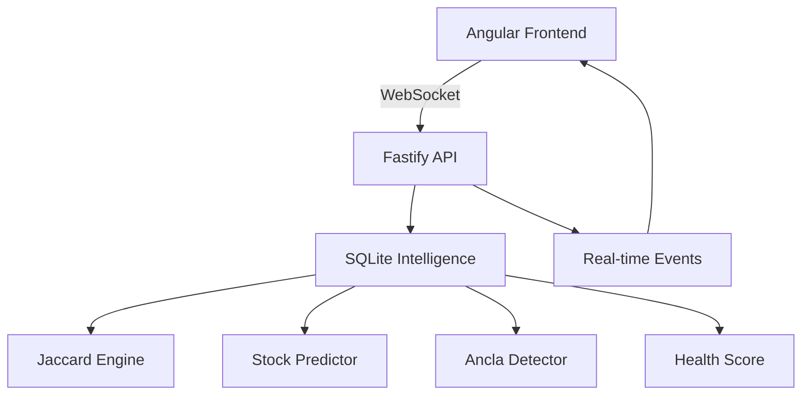

# MarketMesh

> The brain of your store. Predictive marketplace with real-time intelligence.

## 🏗️ Architecture



## 🧠 Intelligence Layers

| Layer | Algorithm | Purpose |
|-------|-----------|---------|
| Recommendations | Jaccard Similarity | Co-purchase patterns |
| Stock Prediction | Velocity Trend | Hours until empty |
| Ancla Detection | Graph Centrality | Products that drive sales |
| Health Score | Weighted Composite | Marketplace vital signs |

## ⚡ Benchmarks

* 200 orders analyzed: <50ms
* Cart recommendations: <100ms
* Health score update: Real-time via WebSocket
* Stock prediction accuracy: ±2h for fast-moving items

## 🎨 Frontend Features

* Force Graph: D3.js force simulation with emoji nodes
* Aura Effect: CSS pulse animation on trending products
* Health Ring: SVG animated score indicator
* Predictive Checkout: Smart alerts before purchase

## 🚀 Deploy

```bash
# Backend
cd marketmesh-api
npm run seed
npm run dev

# Frontend
cd marketmesh-web
ng serve
```

## 📸 Demo

[Live Demo](https://marketmesh.vercel.app)

## 📄 License

MIT
